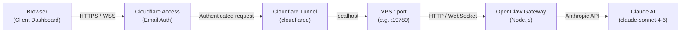

# Architecture

## Request Flow

## Components

| Component | Role |
|-----------|------|
| **Browser** | Standalone `app.html` dashboard served over HTTPS |
| **Cloudflare Access** | Zero-trust email-based authentication layer |
| **Cloudflare Tunnel** | Encrypted outbound tunnel — no open inbound ports on VPS |
| **VPS : port** | Hetzner (or similar) Linux server running OpenClaw |
| **OpenClaw Gateway** | WebSocket gateway that manages sessions, memory, and tool dispatch |
| **Claude AI** | Anthropic model that processes messages and executes tools |

## Deployment

Each client gets:
- A subdomain: `<name>.belagent.com`
- A dedicated Cloudflare Tunnel + Access policy (email allowlist)
- An OpenClaw instance on a unique port

Run `scripts/setup-client.sh` to provision a new client automatically.
